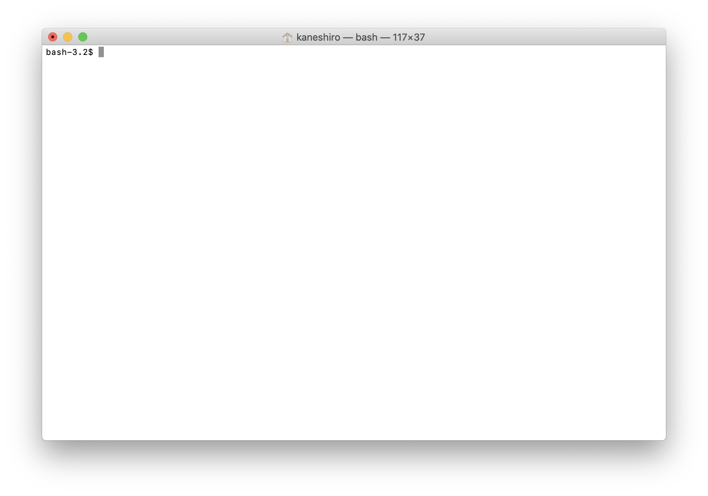
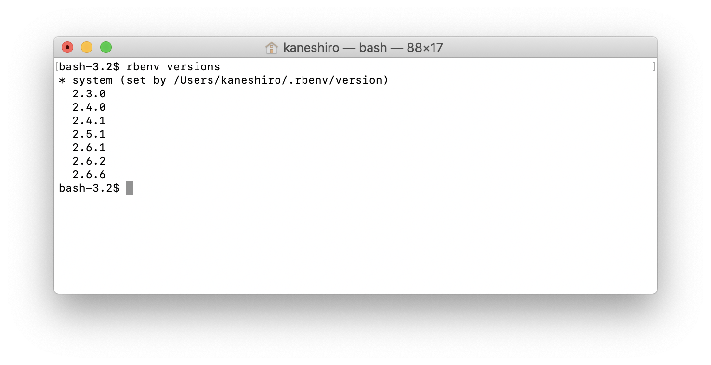
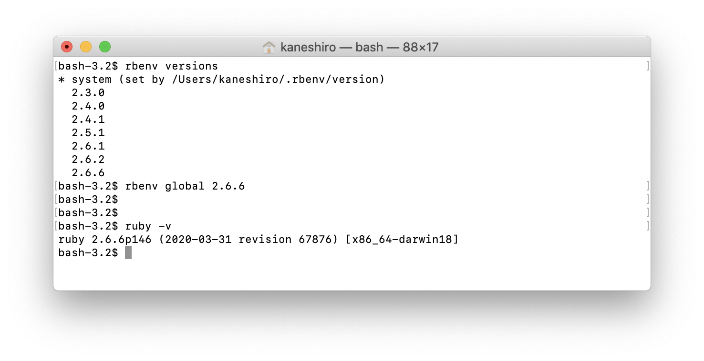
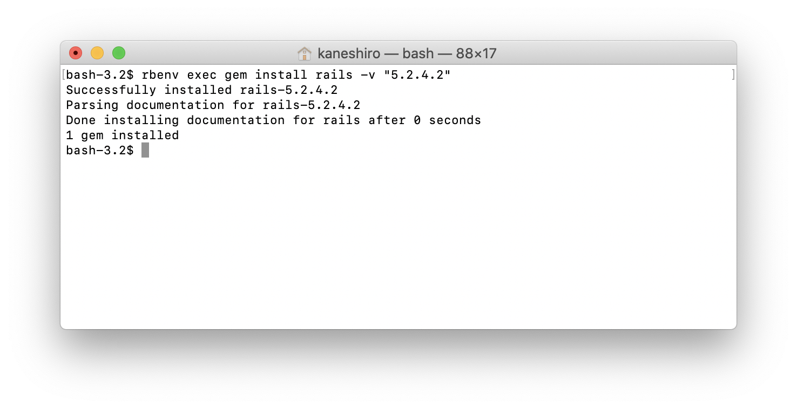

# Ruby on Railsで開発するウェブアプリケーション 環境構築方法編 (Windows/MacOS)

このサイトのコンテンツとして取りまとめるプロダクト開発実践講座では、将来的なチーム開発を見据えつつ、まずは講座参加者ひとりひとりが自力で1つのウェブアプリケーションを設計・開発し、リリースできるようになることを目指しています。

千里の道も一歩から。  
まずはRuby on Railsを用いた開発を行うための環境構築について解説します。

## そもそもRubyおよびRuby on Railsとは何か？

### Rubyとはプログラミング言語そのものです
まずRubyについて簡単に説明をします。

**Ruby**とはプログラミング言語のひとつです。  
プログラミング言語には例えば

 - C言語（単にCとも言う）
 - Java
 - PHP
 - Python
 - JavaScript

など、多種多様なものが存在します。  
Rubyもそのうちのひとつで、後述するRuby on Railsを用いたウェブアプリケーション開発の流行と共に世界中で使われるようになったプログラミング言語です。

開発者は実は日本人で、現在でも最新のテクノロジーを取り込んだり、他の言語の良い部分を参考にしながら日々改善・アップデートが行われています。


### Ruby on RailsはRubyを用いてウェブアプリケーションを開発するためのフレームワーク

**Ruby on Rails**とは、Rubyを用いてウェブアプリケーションを開発するためのフレームワークです。  
Ruby on RailsそのものもRubyで開発されています。

フレームワークとは何か、については別記事にて詳しく説明しますので、今の時点では  
「ウェブアプリケーションを開発するために利用するもの」  
とだけ覚えておいてください。

今後、開発を進めていくうえでは  
「これはRubyの機能なのか、それともRuby on Railsの機能なのか」  
を把握しながら進めていくことができると、分からないことが出てきたり、バグ（不具合）に直面した際に検索を行う効率がアップします。

Ruby on Railsの特徴やその設計思想・機能については別途記事にまとめて紹介します。

さて、それでは今後の開発を進めていくために自分のパソコンにRubyおよびRuby on Railsの開発環境を作っていきましょう。

開発環境を作らなければ、せっかくプログラムを書いても動かすことができません。

開発環境の作り方についてはWindowsとMacOSで手順が異なりますのでそれぞれ解説します。


## WindowsにRuby on Rails開発環境を構築する方法


## MacOSにRuby on Rails開発環境を構築する方法

### MacOSのターミナルを開く
MacにRubyおよびRuby on Railsの開発環境を構築するためにはターミナルと呼ばれるコマンドを実行するアプリケーションを利用する必要があります。

Macでターミナルを開く簡単な方法は、Spotlightと呼ばれる検索機能からアクセスする方法です。

```
⌘(コマンドキー) + スペースキー
```

を押すとSpotlightがポワンと表示されますので、そこに「ターミナル」と入力しましょう。  
予測変換も効いてターミナルのアプリケーションを開くことができます。


開いてみると下記のような画面が表示され、文字を入力することが可能になります。

なお、各自の環境設定によって初期表示される文字や色などは異なりますが、できることは変わりませんので気にしないで大丈夫です。



環境構築後もターミナルを使う機会は多いため、呼び出し方は覚えておきましょう。

### Rubyをrbenvを用いてインストールする
次にRubyをインストールしてきます。

とはいったものの、実はMacには最初からRubyがインストールされています。
ターミナルで

```
Ruby -v
```

と入力して実行すると現在インストールされているRubyのバージョンが表示されるはずです。


ただし、この時点でインストールされているRubyはバージョンが古かったりしますし、実際の開発では案件ごとにRubyのバージョンを切り替える必要があったりします。  
そのため、複数のRubyをバージョン指定しつつインストールできる**rbenv**と呼ばれるものを導入し、そのrbenvを用いて本講座で利用するRubyをインストールしていきましょう。

#### rbenvをインストールするためにHomebrewをインストールする
rbenvをインストールするためにはMacのパッケージマネージャー**Homebrew**を用いますので、まずはHomebrewをインストールしていきます。

Rubyをインストールするためにrbenvが必要で、  
そのrbenvをインストールするためにはHomebrewが必要で、  
と言われると混乱してしまうかもしれませんがなんとか耐えてください。  
パンを作るための小麦粉を作るために小麦を収穫するようなものです。美味しいパンのために頑張りましょう。

Homebrewについては既にインストールされている方もいらっしゃるかもしれませんので、まずはHomebrewがインストールされているかを確認してみましょう。

ターミナルで

```
brew -v
```

と実行し、

>brew: command not found

と表示された方はHomebrewがインストールされていないため下記の通りインストール作業を行いましょう。  
Homebrewのバージョンが表示された方はHomebrewがインストール済ですので、このステップはスキップしてrbenvのインストール作業に進んでください。

さて、Homebrewをインストールするには下記のコマンドを実行する必要があります。

```
/usr/bin/Ruby -e "$(curl -fsSL https://raw.githubusercontent.com/Homebrew/install/master/install)"
```

途中でMacのログインパスワードの入力が求められたり、Homebrewのインストールを行うためにXcodeと呼ばれるアプリケーションのインストールやアップデートの許可が求められたりするケースがありますが、Enterキーを押したりパスワードを入力したり許可ボタンを押したりして進めていきましょう。

例えばパスワード入力とXcodeのインストールが求められている場合は下記のようになりますが、何も恐れることはありません。安全です。


インストールが完了すると

>Installation successful!

と表示されます。


この状態まで進んだ方は、今一度

```
brew -v
```

コマンドを入力してHomebrewがインストールされており、そのバージョンが表示されることを確認しましょう。

#### rbenvをインストールする
続いて、Homebrewを用いてrbenvをインストールします。

ターミナルで下記のコマンドを入力します。

```
brew install rbenv Ruby-build
```

するとインストールが実行され、rbenvの環境が用意されます。  

rbenvが正しくインストールされた場合は

```
rbenv -v
```

のコマンド実行でインストールされたrbenvのバージョンが確認できます。


また、インストール後はrbenvの設定を行う必要がありますので下記コマンドを実行してください。

```
echo 'eval "$(rbenv init -)"' >> ~/.bash_profile
source ~/.bash_profile
```

特に画面上の変化はありませんが問題ありません。  
おまじないだと思って頂いて結構です。

#### rbenvを用いてRubyをインストールする
いよいよrbenvを用いてRubyをインストールするときがやってきました。

```
rbenv install --list
```

のコマンドを実行すると、インストール可能なRubyのバージョンが一覧で表示されます。


非常に多くのバージョンが存在していることがわかるかと思います。

本講座では、**バージョン2.6.6**を利用しますので、下記コマンドで2.6.6のRubyをインストールしましょう。

```
rbenv install 2.6.6
```

インストールが完了しましたら、下記のコマンドでrbenv経由でインストールされたRubyのバージョンを表示してみましょう

```
rbenv versions
```



上記画像ではたくさんのバージョンが表示されているかと思いますが、皆さんの環境ではsystemと2.6.6の2つのバージョンが表示されていれば問題ありません。

なお、systemというのはMacOSに最初からインストールされているRubyのことを指します。

無事にインストールできているようでしたら、普段利用するRubyのバージョンを先程インストールした2.6.6に指定します。

```
rbenv global 2.6.6
```

上記コマンドを実行後、現在ターミナルが利用しようとしているRubyのバージョンを確認してみると2.6.6と表示されるはずです。

```
Ruby -v
```



以上でRubyのインストールは完了です！  
お疲れさまでした！

続いてRuby on Railsのインストールに進みましょう。

### Ruby on Railsをインストールする
Ruby環境ができていればRuby on Railsのインストールは簡単！  
下記コマンドでインストールが可能です。

```
rbenv exec gem install rails -v "5.2.4.2"
```



コマンドについて簡単に説明をします。

```
rbenv exec
```

というのは、先程インストールしたrbenvを用いて以降のコマンドを実行するという意味です。  
この記載がなくてもRuby on Railsのインストール自体はできるのですが、最初からMacOSにインストールされているRuby環境下にRuby on Railsがインストールされてしまったりなど、想定外のことが発生する可能性があるため忘れないようにしましょう。

```
gem install
```

というのは、Rubyのライブラリ(パッケージ)管理ツールであるgemというものを用いてRuby on Railsをインストールするぞ！ということを宣言している部分です。  
ライブラリ(パッケージ)とは、Rubyで利用できる機能をまとめたもののことを指し、世界中のエンジニアが日々大量に開発をしてくれています。感謝。

```
rails -v "5.2.4.2"
```

というのは、gemでインストールするのがRuby on Railsのバージョン5.2.4.2であることを示しています。  
Ruby on Railsにも非常に多くのバージョンがあり、日々バージョンアップがされていますが、本講座では多くの開発現場で用いられているバージョン5系の最新である5.2.4.2を採択しました。

さて、ここまで無事にインストール作業を進めることができ、その全てに成功した場合は下記コマンドでRuby on Railsのインストールが確認できるはずです。

```
rails -v
```


無事にRuby on Railsのバージョンが確認できたら開発環境の準備は万全です！  
お疲れさまでした！